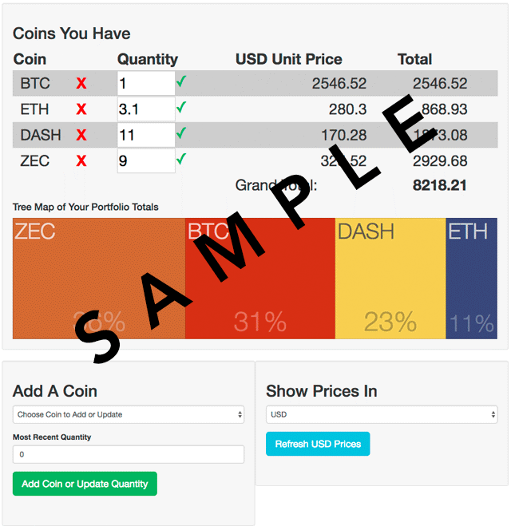

# Node-Capstone: Bitcoin/Altcoin Portfolio Calc

<p><a href="https://node-capstone.herokuapp.com/profile">Bitcoin/Altcoin Portfolio Calc</a> is an app that to keeps track of your Bitcoin / Altcoin portfolio's current value</p> <p>Currently only 6 (BTC, ETH, LTC, DASH, ZEC and DOGE) and 3 currencies (USD, EUR, and CNY) are supported</p>



## Getting started
### Installing
```
>   git clone https://github.com/CryptoCoinUser/node-capstone.git
>   cd node-capstone
>   npm install
```
### Launching
```
>   nodemon server
```
Open [`localhost:8080`]
### Testing
```
>   npm test
```

<h2>Technology Used</h2>

<h3>Front End</h3>
<ul>
  <li>HTML5</li>
  <li>CSS3</li>
  <li>JavaScript</li>
  <li>jQuery</li>
  <li><a href="http://d3plus.org/examples/advanced/9860999/">D3Plus Visualization Library</a></li>
</ul>

<h3>Back End</h3>
<ul>
  <li>Started with a <a href="https://github.com/scotch-io/easy-node-authentication">Node Authentication Demo by Scotch-IO</a></li>
  <li>Price feed by <a href="https://www.cryptocompare.com/api/">CryptoCompare.com API</a></li>
  <li>Node JS</li>
  <li>MongoDB &amp; Mongoose</li>
  <li>Mocha &amp; Chai testing</li>
  <li>Travis CI &amp; Heroku deployment</li>
  <li>Passport JS user management</li>
</ul>

